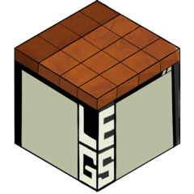
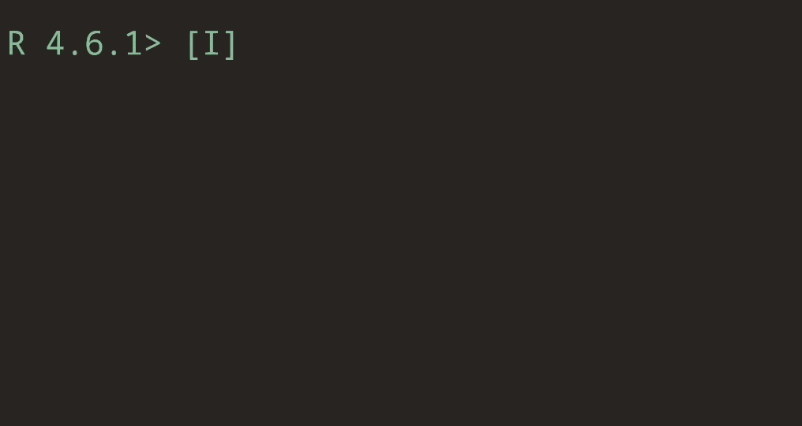
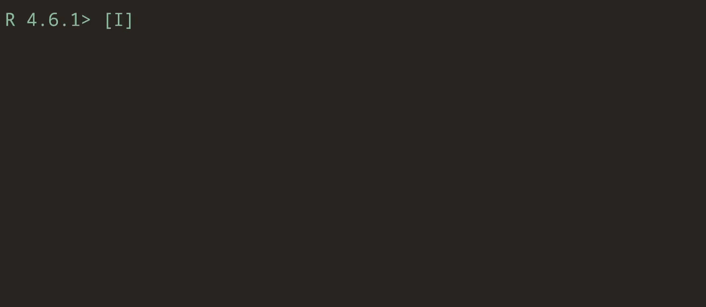

# legs <a href="https://ryanzomorrodi.github.io/legs/"></a>

<!-- badges: start -->
[](https://github.com/ryanzomorrodi/legs/actions/workflows/R-CMD-check.yaml)
<!-- badges: end -->

A TUI for viewing R data

## Installation

You can install the development version of legs from [GitHub](https://github.com/) with:

``` r
# install.packages("pak")
pak::pak("ryanzomorrodi/legs")
```

## Usage

`legs` is a Terminal User Interface (TUI) for viewing your data in R. `legs` is capable of viewing
`data.frame`s, `matrix`s, `lists`, and atomic `vectors`. Just call `legs::view()` on your object to 
open the viewer in your terminal.



Navigate the terminal with the following key bindings:

Key | Action
--- | ---
`hjkl` (or `← ↓ ↑ →`) | Move cursor
`HJKL` (or `Shift + ← ↓ ↑ →`) | Page over
`g` | Select top row
`<n>G` | Select bottom row (or `<n>` row) 
`^` | Select first column
`$` | Select last column
`<n>t` | Toggle truncation (or set truncation to `<n>` characters)
`Enter` | View the cell highlighted
`esc` | View the parent data structure
`y` | Yank (copy) selected cell
`?` | View this help screen
`q` | Exit

All scroll movement key bindings can also be prefixed with a number to perform it `<n>` times. For example,
pressing `25h` scrolls down 25 rows.

`legs::view()` also prints the last frame shown and silently returns the last item viewed. Meaning you can
use it to interactive pluck deeply nested data.


